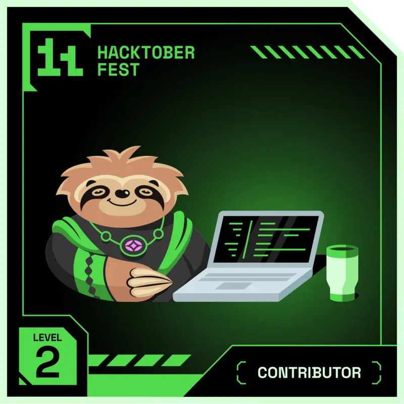

<!-- ==================== HEADER ==================== -->

  

<h1 align="center">Hey! I'm Sakina</h1>

  

  

<!-- ==================== ABOUT ME ==================== -->
<h2 align="center" style="font-family: 'Poppins', sans-serif; text-shadow: 1px 1px 2px #aaa;">About Me</h2>

  Currently diving into <strong>Full-Stack Development</strong> 
  Passionate about crafting <strong>aesthetic, responsive, and user-friendly interfaces</strong> 
  Proficient in <strong>
    C, C++, Python, HTML, CSS, JavaScript, TypeScript, 
    React, React Native, Vue, Node.js, MySQL, Supabase, etc.
  </strong>  
  <strong>Feel free to reach out!</strong> 
  <strong>Always eager to learn new technologies</strong> 
  <strong>Open to collaborations and projects</strong>

<!-- ==================== CONNECT ==================== -->
<h2 align="center">Connect with Me</h2>

  
  
  
  

<!-- ==================== TECH STACK ==================== -->
<h2 align="center">Tech Stack</h2>

  

<!-- ==================== HACKTOBERFEST ==================== -->
<h2 align="center">Hacktoberfest</h2>

  Proud <strong>Hacktoberfest 2024 &amp; 2025 Finisher</strong> — <strong>Super Contributor</strong>

  <!-- 2024 badges -->
  
  
  
  
    
  <!-- 2025 badges -->
  
  
  
  
  
  

  

<!-- ==================== GITHUB STATS ==================== -->
<h2 align="center">GitHub Analytics</h2>

  
  

  

<!-- ==================== RECENT ACTIVITY ==================== -->
<h2 align="center">Recent Activity</h2>

<!--START_SECTION:activity-->
<!--END_SECTION:activity-->

<!-- ==================== LIVE DEVELOPER METRICS ==================== -->
<h2 align="center">Live Developer Metrics</h2>

  

  

